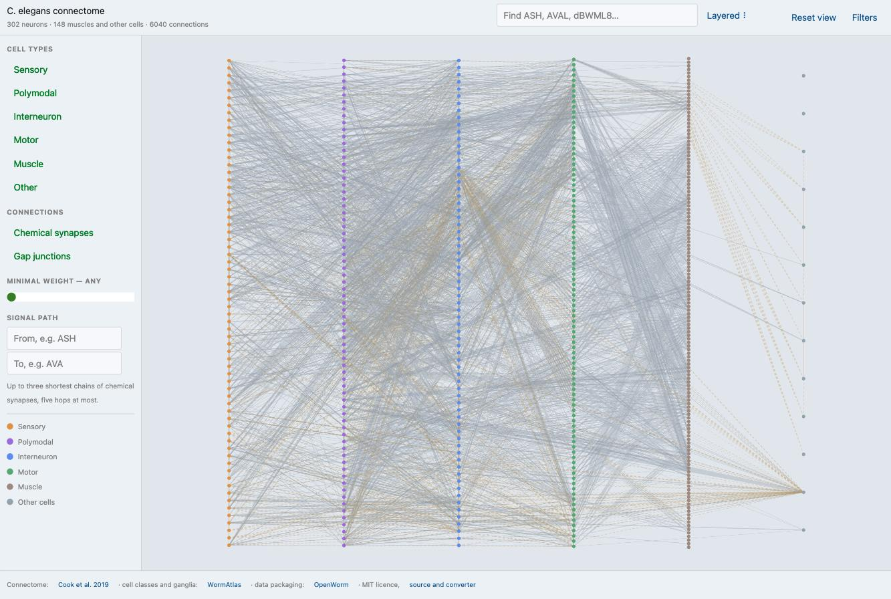
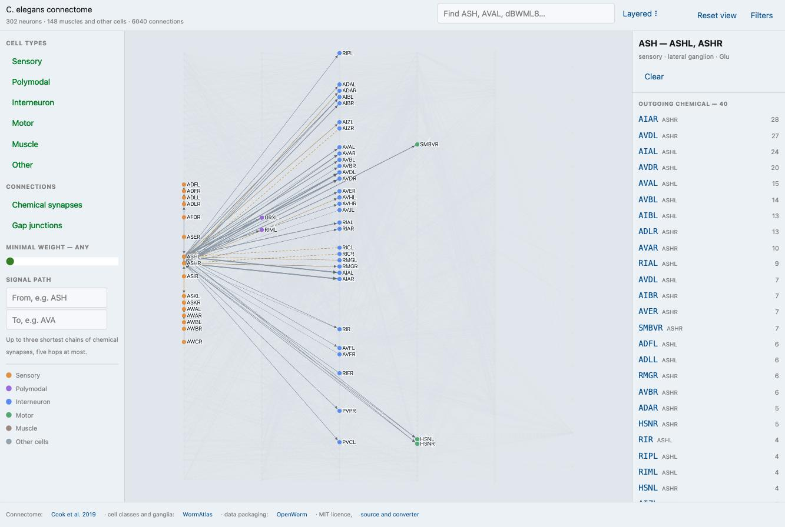
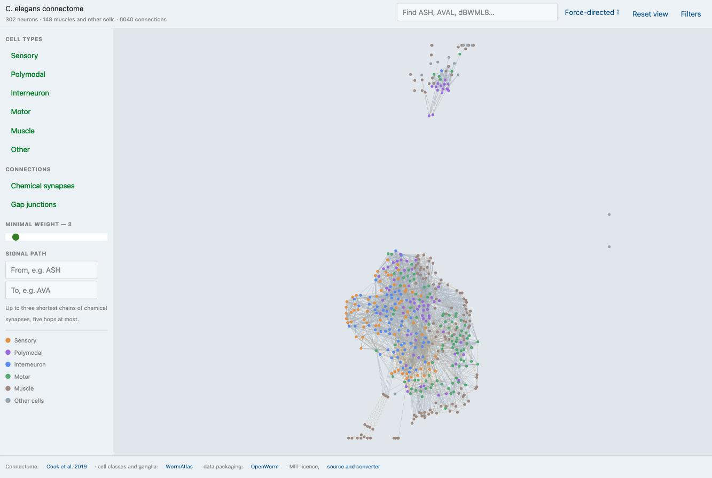

# C. elegans connectome

Interactive map of the whole nervous system of *Caenorhabditis elegans* — 302 neurons, their
muscles, and every synapse between them. Static, offline-capable, and every view is a link.

**[Open the app →](https://b-on-g.github.io/worm/)**

[](https://b-on-g.github.io/worm/)

## What it does

- **Two layouts.** Layered — sensory → polymodal → interneurons → motor → muscle, sorted by ganglion
  inside each column. Force-directed — a deterministic Fruchterman-Reingold run, identical on every
  machine and every reload.
- **Chemical synapses and gap junctions** are told apart: directed grey lines with arrow heads
  versus undirected dashed amber ones. Line width grows with the logarithm of the synapse count.
- **Focus.** Click a cell — or type its name — and it lights up together with its first-order
  neighbours while the rest of the graph fades. A class name works too: `ASH` selects both ASHL and
  ASHR. Click again, press `Esc`, or hit *Clear* to drop the selection.
- **Connection list.** Every incoming, outgoing and electrical connection of the selected cell,
  heaviest first. Clicking a row moves the selection there.
- **Filters.** Cell types, connection kinds, and a minimal-weight slider that thins the graph down
  to its backbone.
- **Signal paths.** Pick two cells and see up to three shortest chains of chemical synapses between
  them, at most five hops long — `ASH → AVA` shows the escape response, `ASH → dBWML8` follows it
  all the way into a body wall muscle.
- **Shareable state.** Layout, focus, filters and the path endpoints all live in the address, so a
  link restores exactly what you were looking at.
- **Offline.** A service worker caches the app; after the first visit it works with the network off.

| Focus on a neuron class | Force-directed layout |
| --- | --- |
|  |  |

## Data

| What | Source |
| --- | --- |
| Synapses and gap junctions | Cook S.J. et al. *Whole-animal connectomes of both Caenorhabditis elegans sexes.* Nature 571, 63–71 (2019) — [doi:10.1038/s41586-019-1352-7](https://doi.org/10.1038/s41586-019-1352-7), hermaphrodite whole-animal edge list as republished by [OpenWorm c302](https://github.com/openworm/c302) |
| Cell function classes, neurotransmitters | [owmeta](https://github.com/openworm/owmeta) export shipped with c302, based on [WormAtlas](https://www.wormatlas.org/) |
| Ganglion membership, soma coordinates | [WormAtlas](https://www.wormatlas.org/), as packaged by [wormneuroatlas](https://github.com/francescorandi/wormneuroatlas) |
| Cell descriptions | [WormAtlas](https://www.wormatlas.org/neurons/Individual%20Neurons/Neuronframeset.html), as packaged by [OpenWorm ConnectomeToolbox](https://github.com/openworm/ConnectomeToolbox) |

The graph holds 450 cells — 302 neurons plus 148 muscles and other end organs — with 4681 chemical
synapses and 1359 gap junctions. Neuron classes are derived from the names themselves rather than a
hand-written table, and the converter refuses to emit a dataset that does not come out at 302
neurons in 118 classes.

Nothing is fetched at runtime: the whole dataset is compiled into the bundle. See
[`scripts/README.md`](scripts/README.md) for how to refresh it from the sources.

## Repository

```
index.html          entry point
worm.view.*         the application shell — header, stage, footer, URL state
graph/              the connectome as a graph: parsing, layouts, shortest paths, tests
plot/               the canvas: drawing, panning, zooming, hit testing
panel/              filters, signal path picker, legend
detail/             connection list of the selected cell
slider/             a native range input, $mol has no slider of its own
hue/                the shared cell colour palette
data/               connectome.json plus the generated data.ts compiled into the bundle
scripts/            the CSV to JSON converter and its vendored sources
PRD.md              the product requirements this was built from
```

## Building

The app is a [MAM](https://github.com/hyoo-ru/mam) module written in [$mol](https://mol.hyoo.ru/).
Clone it into a MAM workspace as `bog/worm`, then:

```bash
npm start bog/worm            # dev server on http://localhost:9080/bog/worm/
node bog/worm/-/node.test.js  # unit tests
node scripts/build-data.mjs   # regenerate data/ from scripts/source/
```

The published bundle is about 440 KB of JavaScript, data included.

## Licence

MIT, see [LICENSE](LICENSE). The connectome data belongs to its authors and is used under the terms
of the publications and repositories linked above.
